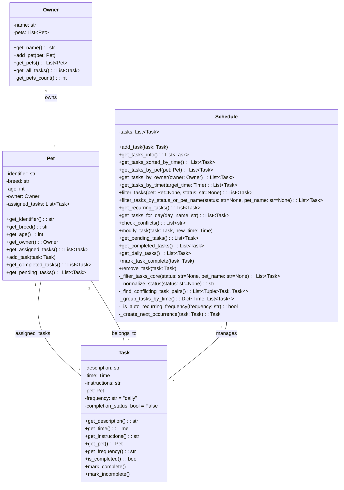

# PawPal+ Class Diagram

## Updated Design (Front Desk Centered)

## Key Relationships

- **Owner → Pet**: One owner can have multiple pets
- **Pet → Task**: Each pet has multiple assigned tasks
- **Task → Pet**: Each task belongs to exactly one pet (enables conflict detection)
- **Schedule → Task**: Centralized schedule manages all tasks across all owners/pets
- **Schedule.add_task(...) side effect**: adding to Schedule also adds the same task to Pet.assigned_tasks
- **Schedule.mark_task_complete(...) behavior**: recurring daily/weekly tasks auto-create the next pending occurrence

## System User

The **Front Desk Person** operates this system:
1. Creates new owners
2. Adds pets to owners
3. Schedules tasks for pets
4. Checks the central schedule for conflicts
5. Resolves conflicting times
