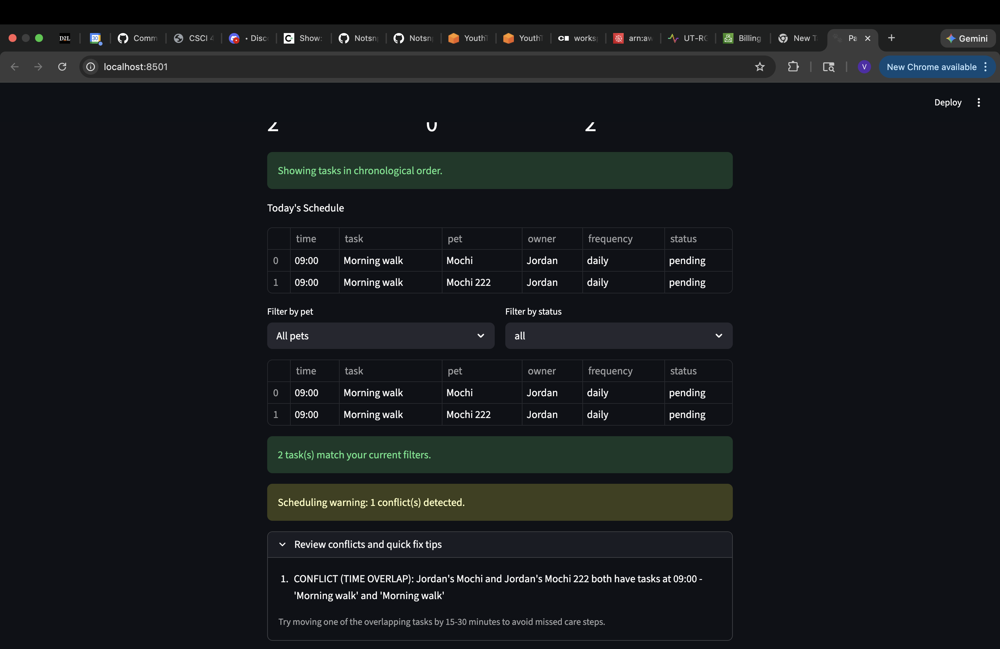

# PawPal+ (Module 2 Project)

You are building **PawPal+**, a Streamlit app that helps a pet owner plan care tasks for their pet.

## Scenario

A busy pet owner needs help staying consistent with pet care. They want an assistant that can:

- Track pet care tasks (walks, feeding, meds, enrichment, grooming, etc.)
- Consider constraints (time available, priority, owner preferences)
- Produce a daily plan and explain why it chose that plan

Your job is to design the system first (UML), then implement the logic in Python, then connect it to the Streamlit UI.

## What you will build

Your final app should:

- Let a user enter basic owner + pet info
- Let a user add/edit tasks (duration + priority at minimum)
- Generate a daily schedule/plan based on constraints and priorities
- Display the plan clearly (and ideally explain the reasoning)
- Include tests for the most important scheduling behaviors

## Smarter Scheduling

Recent backend improvements include:

- Time-based sorting so schedules always display in chronological order.
- Flexible filtering by completion status and pet name.
- Recurring task support where daily/weekly tasks auto-create the next pending instance when completed.
- Lightweight conflict warnings when two tasks share the same start time (same pet or different pets).

## Features

- Chronological task sorting: tasks are ordered by start time so owners can follow a clear day plan.
- Centralized schedule with pet sync: adding a task to the scheduler also adds it to that pet's assigned task list.
- Conflict warnings for duplicate times: overlaps are flagged for both same-pet conflicts and cross-pet time overlaps.
- Completion tracking: tasks can be marked complete/incomplete and queried by status.
- Recurrence support: daily and weekly frequencies are supported, with one-time tasks handled separately.
- Auto-generation of next recurring task: completing daily/weekly tasks automatically creates the next pending occurrence.
- Day-based recurrence expansion: schedule can return tasks for a specific day using daily, weekday, and weekly:day rules.
- Flexible filtering: tasks can be filtered by pet name and status with normalized input handling.
- Schedule health summary in UI: app shows total/completed/pending metrics with sorted and filtered tables.

## 📸 Demo

<a href="pawpalplus.png" target="_blank"></a>

## Getting started

### Setup

```bash
python -m venv .venv
source .venv/bin/activate  # Windows: .venv\Scripts\activate
pip install -r requirements.txt
```

### Suggested workflow

1. Read the scenario carefully and identify requirements and edge cases.
2. Draft a UML diagram (classes, attributes, methods, relationships).
3. Convert UML into Python class stubs (no logic yet).
4. Implement scheduling logic in small increments.
5. Add tests to verify key behaviors.
6. Connect your logic to the Streamlit UI in `app.py`.
7. Refine UML so it matches what you actually built.

## Testing PawPal+

Run the test suite with:

```bash
python -m pytest
```

Current tests cover core scheduler behaviors, including:

- Sorting correctness: tasks are returned in chronological order.
- Recurrence logic: completing daily and weekly recurring tasks creates a new pending occurrence, while one-time tasks do not.
- Conflict detection: duplicate start times are flagged for same-pet and cross-pet overlaps.
- Filtering and status handling: task queries by pet name/status, plus edge cases like unknown status values and whitespace normalization.
- Data consistency and boundaries: remove-task sync between schedule and pet task lists, empty-schedule safety, and time boundary ordering.

Confidence Level: 4/5 stars based on all current tests passing and good edge-case coverage for scheduling fundamentals.
